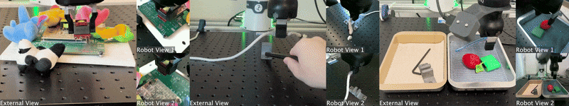

# SERL: 高效样本机器人强化学习软件套件




**项目网站: 1 [https://serl-robot.github.io/](https://serl-robot.github.io/) 2 [https://hil-serl.github.io/](https://hil-serl.github.io/)**


SERL 提供了一套库、环境包装器和示例，用于训练机器人操作任务的强化学习策略。以下章节介绍如何使用 SERL。我们将通过示例来说明用法。

🎬: [SERL 视频](https://www.youtube.com/watch?v=Um4CjBmHdcw), [补充视频](https://www.youtube.com/watch?v=17NrtKHdPDw) 关于高效样本强化学习。

**目录**
- [SERL: 高效样本机器人强化学习软件套件](#serl-高效样本机器人强化学习软件套件)
  - [主要更新](#主要更新)
  - [安装](#安装)
  - [环境配置完成](#环境配置完成-)
  - [概览和代码结构](#概览和代码结构)
  - [仿真环境快速开始](#仿真环境快速开始)
  - [真实 Franka 机械臂运行](#真实-franka-机械臂运行)
  - [快速参考指南](#-快速参考指南-quick-reference-guide)
    - [快速开始命令](#快速开始命令-quick-start-commands)
    - [关键文件路径](#关键文件路径-key-file-paths)
    - [重要超参数](#重要超参数-important-hyperparameters)
    - [常用 API](#常用-api-common-apis)
    - [机器人服务器 API](#机器人服务器-api-robot-server-api)
    - [故障排查](#故障排查-troubleshooting)
    - [最佳实践](#最佳实践-best-practices)
    - [有用的代码片段](#有用的代码片段-useful-code-snippets)
    - [快捷命令](#快捷命令-quick-commands)
    - [有用的链接](#有用的链接-useful-links)
  - [贡献](#贡献)
  - [引用](#引用)

## 主要更新

#### 2024年6月24日
对于使用 SERL 进行涉及夹爪控制的任务（例如抓取物体）的用户，我们强烈建议为夹爪动作变化添加一个小的惩罚，因为这将大大提高训练速度。详细信息请参考：[PR #65](https://github.com/rail-berkeley/serl/pull/65)。

此外，我们还建议在训练期间除了加载离线演示之外，还提供在线干预。如果您有 Franka 机器人和 SpaceMouse，只需在训练期间触摸 SpaceMouse 即可轻松实现。

#### 2024年4月25日
我们修复了干预动作坐标系中的一个重大问题。请参见发布 [v0.1.1](https://github.com/rail-berkeley/serl/releases/tag/v0.1.1)，请使用 main 分支更新您的代码。


## 安装

1. **设置 Conda 环境：**
    创建环境：
    
    ```bash
    conda create -n serl python=3.10
    ```
    
2. **安装 Jax：**
    - CPU 版本（不推荐）：
        ```bash
        pip install -i https://pypi.tuna.tsinghua.edu.cn/simple "jax[cpu]==0.4.33" "jaxlib==0.4.33"
        ```

    - GPU 版本：
        ```bash
        pip install --upgrade "jax[cuda12_pip]==0.4.35" -f https://storage.googleapis.com/jax-releases/jax_cuda_releases.html
        ```

    - TPU 版本：
        ```bash
        pip install --upgrade "jax[tpu]" -f https://storage.googleapis.com/jax-releases/libtpu_releases.html
        ```
    - 有关安装 Jax 的更多详细信息，请参见 [Jax Github 页面](https://github.com/google/jax)。

3. **安装 serl_launcher**
    
    ```bash
    cd serl_launcher
    pip install -e .
    pip install -r requirements.txt
    ```
    
4. **安装 mujoco_env（用于仿真）**
    ```bash
    cd mujoco_env
    pip install -e .
    pip install -r requirements.txt
    ```


## 环境配置完成 ✅

### 环境信息
- **Conda环境**: `serl`
- **Python版本**: 3.10
- **主要包**: serl_launcher, mujoco_env, gymnasium, mujoco

### 环境变量说明

- `MUJOCO_GL=glfw` - 使用窗口渲染（需要显示器）
- `MUJOCO_GL=osmesa` - 离屏渲染（无需显示器，用于服务器）
- `MUJOCO_GL=egl` - EGL渲染（GPU加速的离屏渲染）

### 测试安装

**测试 MuJoCo 环境：**
```bash
conda activate serl
python -c "import gym; import mujoco_env; env = gym.make('PandaPickCube-v0'); print('环境创建成功！')"
```

**检查 GPU（如果已安装 GPU 版本）：**

```bash
python -c "import jax; print(jax.devices())"
```

### 运行示例

#### MuJoCo Franka 机器人抓取示例

**交互式示例（带可视化窗口）：**

```bash
conda activate serl
cd mujoco_env/example/PandaPickCube
export MUJOCO_GL=glfw
python test_gym_env_human.py
```
- 按 **空格键** 重置环境
- 机器人会随机执行动作尝试抓取方块

**录制视频示例：**
```bash
conda activate serl
cd mujoco_env/example/PandaPickCube
export MUJOCO_GL=osmesa  # 离屏渲染
python test_gym_env_render.py
```
会生成 `franka_lift_cube_render_test.mp4` 视频文件

#### SERL 训练示例

**方式1：使用 tmux 一键启动（推荐）**
```bash
conda activate serl
cd examples/async_sac_state_sim
bash tmux_launch.sh
```
- 自动启动 learner 和 actor 节点
- 使用 `tmux attach -t serl_session` 查看
- 使用 `tmux kill-session -t serl_session` 停止

**方式2：手动启动（两个终端）**

终端1 - Learner节点：
```bash
conda activate serl
cd examples/async_sac_state_sim
bash run_learner.sh
```

终端2 - Actor节点（带可视化）：
```bash
conda activate serl
cd examples/async_sac_state_sim
export MUJOCO_GL=glfw  # 使用窗口渲染
bash run_actor.sh
```

#### 其他可用的训练示例

**从图像观测训练（DRQ）：**
```bash
cd examples/async_drq_sim
bash tmux_launch.sh
```

**使用演示数据训练（RLPD）：**
```bash
cd examples/async_drq_sim
bash tmux_rlpd_launch.sh
```

### 查看运行状态

**查看当前运行的进程：**
```bash
ps aux | grep -E "(async_sac|async_drq)" | grep python
```

**查看日志：**
```bash
# Learner日志
tail -f learner.log

# Actor日志
tail -f actor.log
```

### 常见问题

1. **ImportError: No module named 'mujoco_env'**
   - 确保已安装：`cd mujoco_env && pip install -e .`

2. **渲染窗口无法显示**
   - 检查 DISPLAY 环境变量
   - 尝试使用 `export MUJOCO_GL=osmesa` 进行离屏渲染

3. **Gym deprecation 警告**
   - 这是正常的，代码使用了旧版 gym API，不影响功能


## 概览和代码结构

SERL 为用户提供了一组通用库，用于训练机器人操作任务的强化学习策略。运行强化学习实验的主要结构包括一个执行器（actor）节点和一个学习器（learner）节点，两者都与机器人 gym 环境交互。两个节点异步运行，数据通过网络使用 [agentlace](https://github.com/youliangtan/agentlace) 从执行器发送到学习器节点。学习器将定期与执行器同步策略。这种设计为并行训练和推理提供了灵活性。

<p align="center">
  
</p>

**代码结构表**

| 代码目录 | 描述 |
| --- | --- |
| [serl_launcher](https://github.com/rail-berkeley/serl/blob/main/serl_launcher) | SERL 主代码 |
| [serl_launcher.agents](https://github.com/rail-berkeley/serl/blob/main/serl_launcher/serl_launcher/agents/) | 智能体策略（例如 DRQ、SAC、BC） |
| [serl_launcher.wrappers](https://github.com/rail-berkeley/serl/blob/main/serl_launcher/serl_launcher/wrappers) | Gym 环境包装器 |
| [serl_launcher.data](https://github.com/rail-berkeley/serl/blob/main/serl_launcher/serl_launcher/data) | 重放缓冲区和数据存储 |
| [serl_launcher.vision](https://github.com/rail-berkeley/serl/blob/main/serl_launcher/serl_launcher/vision) | 视觉相关模型和工具 |
| [mujoco_env](./mujoco_env) | Franka MuJoCo 仿真 gym 环境 |
| [serl_robot_infra](./serl_robot_infra/) | 用于真实机器人运行的机器人基础设施 |
| [serl_robot_infra.robot_servers](https://github.com/rail-berkeley/serl/blob/main/serl_robot_infra/robot_servers/) | 通过 ROS 向机器人发送命令的 Flask 服务器 |
| [serl_robot_infra.franka_env](https://github.com/rail-berkeley/serl/blob/main/serl_robot_infra/franka_env/) | 真实 Franka 机器人的 Gym 环境 |

## 仿真环境快速开始

我们提供了一个使用 Franka 机器人尝试 SERL 的仿真环境。

查看 [仿真环境快速开始](/docs/sim_quick_start.md)
 - [基于状态观测的训练示例](/docs/sim_quick_start.md#1-training-from-state-observation-example)
 - [基于图像观测的训练示例](/docs/sim_quick_start.md#2-training-from-image-observation-example)
 - [基于图像观测和 20 条演示轨迹的训练示例](/docs/sim_quick_start.md#3-training-from-image-observation-with-20-demo-trajectories-example)

## 真实 Franka 机械臂运行

我们提供了在真实 Franka 机器人上使用 SERL 运行强化学习策略的分步指南。

查看 [真实 Franka 机械臂运行](/docs/real_franka.md)
 - [插钉任务 📍](/docs/real_franka.md#1-peg-insertion-📍)
 - [PCB 元件插入 🖥️](/docs/real_franka.md#2-pcb-component-insertion-🖥️)
 - [电缆布线 🔌](/docs/real_franka.md#3-cable-routing-🔌)
 - [物体搬运 🗑️](/docs/real_franka.md#4-object-relocation-🗑️)

---


# 🚀 快速参考指南 (Quick Reference Guide)

## 快速开始命令 (Quick Start Commands)

### 仿真环境训练 (Simulation Training)

```bash
# 1. 状态观测 SAC (最简单 / State-based SAC - Simplest)
cd examples/async_sac_state_sim
bash run_learner.sh  # 终端1 / Terminal 1
bash run_actor.sh    # 终端2 / Terminal 2

# 2. 图像观测 DrQ (Image-based DrQ)
cd examples/async_drq_sim
bash tmux_launch.sh  # 一键启动 / One-liner launch

# 3. 图像观测 + 示教数据 (Image + Demo data)
cd examples/async_drq_sim
python async_drq_sim.py --learner --preload_rlds_path=demos.pkl  # 终端1
python async_drq_sim.py --actor                                   # 终端2
```

### 真实机器人 (Real Robot)

```bash
# 1. 启动机器人服务器 (需要 ROS 环境 / Start robot server - requires ROS)
cd serl_robot_infra
python robot_servers/franka_server.py --gripper_type=Robotiq --robot_ip=172.16.0.2

# 2. 激活夹爪 (Activate gripper)
curl -X POST http://127.0.0.1:5000/activate_gripper

# 3. 录制示教 (Record demonstrations)
cd examples/async_peg_insert_drq
python record_demo.py --demo_num=10

# 4. 训练 (Train)
bash run_learner.sh  # 终端1
bash run_actor.sh    # 终端2
```


## 关键文件路径 (Key File Paths)

### 核心算法 (Core Algorithms)

| 功能 (Function) | 文件路径 (File Path) |
|------|----------|
| SAC 算法 | `serl_launcher/serl_launcher/agents/continuous/sac.py` |
| DrQ 算法 | `serl_launcher/serl_launcher/agents/continuous/drq.py` |
| 行为克隆 (BC) | `serl_launcher/serl_launcher/agents/continuous/bc.py` |
| Agent 创建 | `serl_launcher/serl_launcher/utils/launcher.py` |
| Replay Buffer | `serl_launcher/serl_launcher/data/replay_buffer.py` |

### 网络结构 (Network Architectures)

| 功能 (Function) | 文件路径 (File Path) |
|------|----------|
| Actor-Critic | `serl_launcher/serl_launcher/networks/actor_critic_nets.py` |
| ResNet 编码器 | `serl_launcher/serl_launcher/vision/resnet_v1.py` |
| MLP | `serl_launcher/serl_launcher/networks/mlp.py` |
| 奖励分类器 | `serl_launcher/serl_launcher/networks/reward_classifier.py` |

### 环境 (Environments)

| 功能 (Function) | 文件路径 (File Path) |
|------|----------|
| 仿真 Panda (Sim) | `mujoco_env/impl/robots/panda_pick_gym_env.py` |
| 真实 Panda (Real) | `serl_robot_infra/franka_env/envs/` |
| 观测包装器 | `serl_launcher/serl_launcher/wrappers/serl_obs_wrappers.py` |

## 重要超参数 (Important Hyperparameters)

### SAC/DrQ 通用参数 (Common Parameters)

```python
# 训练参数 (Training parameters)
batch_size = 256              # 批次大小 / Batch size
utd_ratio = 1.0               # Update-to-Data 比率 / UTD ratio
critic_actor_ratio = 8        # Critic 更新 8 次，Actor 更新 1 次
learning_rate = 3e-4          # 学习率 / Learning rate

# 探索参数 (Exploration parameters)
random_steps = 300            # 初始随机探索步数
training_starts = 300         # 开始训练前收集的步数
max_steps = 1000000           # 总训练步数

# 网络参数 (Network parameters)
hidden_dims = (256, 256)      # 隐藏层维度 / Hidden dimensions
tau = 0.005                   # Target 网络软更新系数
discount = 0.99               # 折扣因子 γ / Discount factor

# 缓冲区 (Buffer)
replay_buffer_capacity = 1000000  # Replay Buffer 容量

# 日志和评估 (Logging and evaluation)
log_period = 10               # 每 10 步记录一次
eval_period = 2000            # 每 2000 步评估一次
steps_per_update = 30         # 每 30 步同步参数到 Actor
```

### DrQ 特有参数 (DrQ-specific Parameters)

```python
# 视觉编码器 (Vision encoder)
encoder_type = "resnet-pretrained"  # resnet10, mobilenet, small
image_size = (128, 128)             # 图像大小 / Image size

# 数据增强 (Data augmentation)
use_augmentation = True
random_crop_size = 84
```

## 常用 API (Common APIs)

### 创建 Agent (Create Agent)

```python
from serl_launcher.utils.launcher import make_sac_agent, make_drq_agent

# SAC (状态观测 / State observations)
agent = make_sac_agent(
    seed=42,
    sample_obs=env.observation_space.sample(),
    sample_action=env.action_space.sample(),
)

# DrQ (图像观测 / Image observations)
agent = make_drq_agent(
    seed=42,
    sample_obs=env.observation_space.sample(),
    sample_action=env.action_space.sample(),
    image_keys=("image",),
    encoder_type="resnet-pretrained",
)
```

### 采样动作 (Sample Actions)

```python
# 训练时 (带探索 / Training - with exploration)
rng, key = jax.random.split(rng)
action = agent.sample_actions(
    observations=obs,
    seed=key,
    deterministic=False,  # 随机策略 / Stochastic
)

# 评估时 (确定性 / Evaluation - deterministic)
action = agent.sample_actions(
    observations=obs,
    deterministic=True,   # 确定性策略 / Deterministic
)
```

### 更新 Agent (Update Agent)

```python
# 从 Buffer 采样 (Sample from buffer)
batch = replay_buffer.sample(batch_size=256)

# 更新 (Update)
agent, update_info = agent.update(batch, utd_ratio=1.0)

# update_info 包含 / contains:
# - critic_loss: Critic 损失 / loss
# - actor_loss: Actor 损失 / loss
# - q1, q2: Q 值 / values
# - entropy: 策略熵 / Policy entropy
```

### 创建 Replay Buffer

```python
from serl_launcher.utils.launcher import make_replay_buffer

replay_buffer = make_replay_buffer(
    env,
    capacity=1000000,
)

# 插入数据 (Insert data)
replay_buffer.insert({
    'observations': obs,
    'actions': action,
    'next_observations': next_obs,
    'rewards': reward,
    'masks': 1.0 - done,
    'dones': done,
})

# 采样 (Sample)
batch = replay_buffer.sample(batch_size=256)
```


## 机器人服务器 API (Robot Server API)

### HTTP 接口 (Flask HTTP Interface)

```bash
# 基础 URL (Base URL)
BASE_URL="http://127.0.0.1:5000"

# 获取末端位姿 (Get end-effector pose)
curl -X POST $BASE_URL/getpos_euler
# 返回 / Returns: [x, y, z, roll, pitch, yaw]

# 移动到目标位姿 (Move to target pose)
curl -X POST $BASE_URL/pose \
  -H "Content-Type: application/json" \
  -d '{"pose": [0.5, 0.0, 0.3, 1.0, 0.0, 0.0, 0.0]}'  # [x,y,z, qw,qx,qy,qz]

# 夹爪控制 (Gripper control)
curl -X POST $BASE_URL/open_gripper      # 打开 / Open
curl -X POST $BASE_URL/close_gripper     # 关闭 / Close
curl -X POST $BASE_URL/move_gripper -d '{"position": 0.04}'

# 关节重置 (Joint reset)
curl -X POST $BASE_URL/jointreset

# 获取机器人状态 (Get robot state)
curl -X POST $BASE_URL/getstate
```

### Python 接口 (Gym Python Interface)

```python
import gym
import franka_env

# 创建环境 (Create environment)
env = gym.make("FrankaPegInsert-v0")

obs, info = env.reset()
# obs = {
#     'state': np.array([...]),      # 机器人关节位置 / Joint positions
#     'image': np.array([...]),      # 相机图像 / Camera image
#     'tcp_pose': np.array([...]),   # 末端位姿 / TCP pose
# }

# 执行动作 (Execute action)
action = np.array([dx, dy, dz, gripper])  # [位置增量 / position delta, 夹爪 / gripper]
next_obs, reward, done, truncated, info = env.step(action)

# 获取额外信息 (Get additional info)
tcp_pose = env.robot.get_tcp_pose()
tcp_force = env.robot.get_tcp_force()
```

## 故障排查 (Troubleshooting)

### 问题 1: Actor 无法连接到 Learner

**症状 (Symptoms)**:
```
Waiting for server...
Waiting for server...
```

**解决方案 (Solutions)**:
```bash
# 1. 检查 Learner 是否已启动 (Check if learner is running)
ps aux | grep async_sac_state_sim.py

# 2. 检查 IP 地址 (Check IP address)
# 本地 / Local: --ip=localhost
# 远程 / Remote: --ip=<learner_ip>

# 3. 检查防火墙 (Check firewall)
sudo ufw allow 5555  # AgentLace 默认端口 / default port
```

### 问题 2: 训练不收敛 (Training Not Converging)

**可能原因和解决方案 (Possible Causes and Solutions)**:

```python
# 原因 1: 奖励设计不当 (Poor reward design)
# 解决 / Solution: 检查奖励函数，确保有正反馈
def compute_reward(self):
    # ❌ 纯稀疏奖励 / Pure sparse reward
    return 1.0 if success else 0.0
    
    # ✅ 稠密 + 稀疏 / Dense + sparse
    return -distance + 10.0 * success

# 原因 2: 探索不足 (Insufficient exploration)
# 解决 / Solution: 增加 random_steps
--random_steps=1000  # 改为 / change to 2000 或更多

# 原因 3: 学习率过大 (Learning rate too high)
# 解决 / Solution: 降低学习率
--learning_rate=3e-4  # 改为 / change to 1e-4

# 原因 4: 缺少示教数据 (Missing demonstrations)
# 解决 / Solution: 提供人类示教
--preload_rlds_path=demos.pkl
```

### 问题 3: GPU 内存不足 (Out of GPU Memory)

```python
# 解决方案 1: 减小 batch_size (Reduce batch size)
--batch_size=128  # 从 256 降到 128

# 解决方案 2: 减小 Buffer 容量 (Reduce buffer capacity)
--replay_buffer_capacity=500000  # 从 1M 降到 500K

# 解决方案 3: 使用更小的编码器 (Use smaller encoder)
--encoder_type="small"  # 而不是 resnet10

# 解决方案 4: 使用混合精度 (Use mixed precision)
from jax import config
config.update("jax_enable_x64", False)
```

### 问题 4: 真实机器人不动 (Real Robot Not Moving)

**检查清单 (Checklist)**:
```bash
# 1. 机器人是否上电 (Is robot powered on?)
# 检查控制柜背面电源开关

# 2. 机器人是否解锁 (Is robot unlocked?)
# 浏览器访问机器人 IP，点击 "Unlock"

# 3. 机器人是否在 FCI 模式 (Is robot in FCI mode?)
# 按黑白按钮，灯变蓝色

# 4. ROS 控制器是否运行 (Is ROS controller running?)
rosnode list | grep franka
# 应该看到 franka_control 节点

# 5. Flask 服务器是否启动 (Is Flask server running?)
curl -X POST http://127.0.0.1:5000/getpos_euler
# 应该返回当前位姿

# 6. 检查错误 (Check errors)
curl -X POST http://127.0.0.1:5000/getstate
# 查看 "errors" 字段
```

## 最佳实践 (Best Practices)

### 1. 训练流程 (Training Workflow)

```
第一步 / Step 1: 仿真测试 (Simulation Testing)
  ├─ 在 MuJoCo 中验证环境和奖励 (Verify env and reward)
  ├─ 调整超参数 (Tune hyperparameters)
  └─ 确保能在仿真中学会任务 (Ensure task works in sim)

第二步 / Step 2: 录制示教 (Record Demonstrations)
  ├─ 录制 10-20 条人类示教 (Record 10-20 human demos)
  ├─ 检查示教质量 (Check demo quality)
  └─ 使用 BC 预训练 (可选 / Optional BC pretraining)

第三步 / Step 3: 真实机器人训练 (Real Robot Training)
  ├─ 加载示教数据 (Load demonstration data)
  ├─ 小批量测试 (Small batch test - 100-200 steps)
  ├─ 全量训练 (Full training)
  └─ 持续监控安全性 (Continuous safety monitoring)

第四步 / Step 4: 部署 (Deployment)
  ├─ 使用确定性策略 (Use deterministic policy)
  ├─ 添加安全检查 (Add safety checks)
  └─ 记录失败案例 (Log failure cases)
```

### 2. 超参数调优顺序 (Hyperparameter Tuning Order)

```python
# 1. 先调整探索 (First: exploration)
random_steps = [300, 1000, 2000]  # 从小到大尝试 / Try small to large

# 2. 再调整学习率 (Second: learning rate)
learning_rate = [1e-4, 3e-4, 1e-3]  # 通常 3e-4 效果好 / Usually 3e-4 works well

# 3. 然后调整更新频率 (Third: update frequency)
utd_ratio = [1.0, 2.0, 4.0]  # 更频繁的更新 / More frequent updates

# 4. 最后微调网络大小 (Finally: network size)
hidden_dims = [(128, 128), (256, 256), (512, 512)]
```

## 有用的代码片段 (Useful Code Snippets)

### 保存和加载模型 (Save and Load Model)

```python
from flax.training import checkpoints

# 保存 (Save)
checkpoints.save_checkpoint(
    ckpt_dir='./checkpoints',
    target=agent.state,
    step=step,
    prefix='agent_',
    keep=5,  # 保留最近 5 个检查点 / Keep last 5 checkpoints
)

# 加载 (Load)
agent_state = checkpoints.restore_checkpoint(
    ckpt_dir='./checkpoints',
    target=agent.state,
    prefix='agent_',
)
agent = agent.replace(state=agent_state)
```

### 录制演示视频 (Record Demo Video)

```python
import cv2

# 初始化视频写入器 (Initialize video writer)
fourcc = cv2.VideoWriter_fourcc(*'mp4v')
video_writer = cv2.VideoWriter(
    'episode.mp4',
    fourcc,
    30.0,  # FPS
    (640, 480),  # 分辨率 / Resolution
)

# 评估循环 (Evaluation loop)
obs, _ = env.reset()
for step in range(max_steps):
    action = agent.sample_actions(obs, deterministic=True)
    obs, reward, done, truncated, info = env.step(action)
    
    # 渲染并保存帧 (Render and save frame)
    frame = env.render()
    frame_bgr = cv2.cvtColor(frame, cv2.COLOR_RGB2BGR)
    video_writer.write(frame_bgr)
    
    if done or truncated:
        break

video_writer.release()
```

## 快捷命令 (Quick Commands)

```bash
# 环境管理 (Environment management)
conda activate serl
conda deactivate

# 安装 (Installation)
pip install -e serl_launcher
pip install -e serl_robot_infra

# 测试环境 (Test environment)
python -c "import gym; import mujoco_env; env = gym.make('PandaPickCube-v0'); print('Success!')"

# 检查 GPU (Check GPU)
python -c "import jax; print(jax.devices())"

# 清理缓存 (Clean cache)
rm -rf ~/.cache/jax
rm -rf wandb/

# Git 管理 (Git management)
git status
git add .
git commit -m "Add custom environment"
git push origin main
```

## 有用的链接 (Useful Links)

### 官方资源 (Official Resources)
- 项目主页 / Project Page: https://serl-robot.github.io/
- GitHub: https://github.com/rail-berkeley/serl
- 论文 / Paper: https://arxiv.org/abs/2401.16013
- Discord: https://discord.gg/G4xPJEhwuC

### 依赖库 (Dependencies)
- JAX: https://github.com/google/jax
- Flax: https://github.com/google/flax
- MuJoCo: https://mujoco.org/
- AgentLace: https://github.com/youliangtan/agentlace

### 相关论文 (Related Papers)
- SAC: https://arxiv.org/abs/1801.01290
- DrQ: https://arxiv.org/abs/2004.13649
- RLPD: https://arxiv.org/abs/2302.02948

---

## 贡献

我们欢迎对本仓库的贡献！如果您对代码库有任何改进，请 Fork 并提交 PR。在提交 PR 之前，请运行 `pre-commit run --all-files` 以确保代码库格式正确。

## 引用

如果您在研究中使用此代码，请引用我们的论文：

```bibtex
@misc{luo2024serl,
      title={SERL: A Software Suite for Sample-Efficient Robotic Reinforcement Learning},
      author={Jianlan Luo and Zheyuan Hu and Charles Xu and You Liang Tan and Jacob Berg and Archit Sharma and Stefan Schaal and Chelsea Finn and Abhishek Gupta and Sergey Levine},
      year={2024},
      eprint={2401.16013},
      archivePrefix={arXiv},
      primaryClass={cs.RO}
}
```


**相关文档**:
- [仿真环境快速开始](/docs/sim_quick_start.md) - 了解更多训练选项
- [真实机器人部署](/docs/real_franka.md) - 了解真实机器人部署
- [SERL示例详细解析.md](./docs/SERL示例详细解析.md) - 示例代码详细说明
- [学习资源索引.md](./docs/学习路径图.md) - 学习资源和教程
