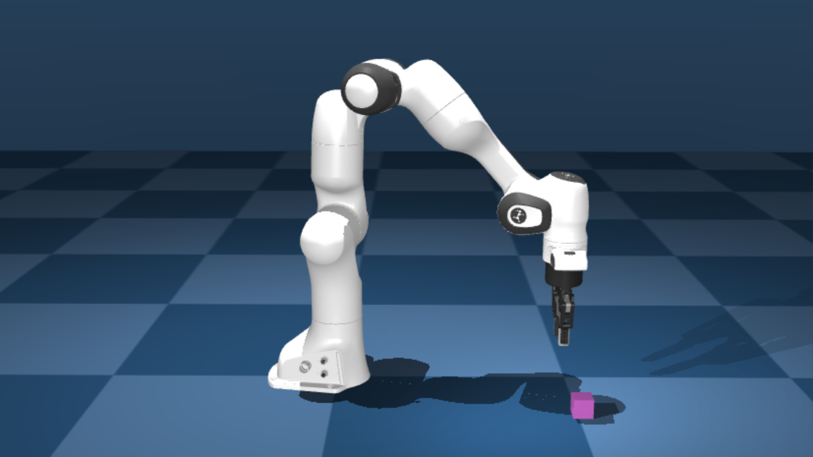

# SERL仿真环境快速入门

| 修订日期   | 修订版本 | 修订内容   | 修订人 |
| ---------- | -------- | ---------- | ------ |
| 2025.12.15 | V0.1     | 初始化文档 | 刘刚   |

这是一个用于 SERL 训练的最小化 mujoco 仿真环境。该环境包含一个 panda 机械臂和一个立方体。目标是将立方体抬起到目标位置。该环境使用 `franka_sim` 和 `gym` 接口实现。



## 安装

**安装 Franka Sim 库**
```bash
    cd franka_sim
    pip install -e .
    pip install -r requirements.txt
```

通过运行 `python franka_sim/franka_sim/test/test_gym_env_human.py` 来测试 `franka_sim` 是否正常工作。

在开始之前，请确保 `franka_sim` 仿真环境正常工作。

*注意：如果您要进行离屏渲染，需要将 `MUJOCO_GL` 设置为 egl。
您可以通过 ```export MUJOCO_GL=egl``` 来设置，并记得在脚本中将渲染参数设置为 False。
如果收到 `Cannot initialize a EGL device display due to GLIBCXX not found` 错误，请尝试运行 `conda install -c conda-forge libstdcxx-ng` ([参考](https://stackoverflow.com/a/74132234))*


可选安装 `tmux`：`sudo apt install tmux`

## 1. 基于状态观测的训练示例

**✨ 一键启动器（需要 `tmux`）✨**
```bash
bash examples/async_sac_state_sim/tmux_launch.sh
```

要终止 tmux 会话，运行 `tmux kill-session -t serl_session`。

### 不使用一键 tmux 启动器

您可以选择在 2 个不同的终端中分别运行命令。

```bash
cd examples/async_sac_state_sim
```

运行学习器节点：
```bash
bash run_learner.sh
```

运行带渲染窗口的执行器节点：
```bash
# 如果在不同机器上运行，添加 --ip x.x.x.x
bash run_actor.sh
```

您可以选择在不同机器上启动学习器和执行器。例如，如果学习器节点运行在 IP 为 `ip=x.x.x.x` 的 PC 上，您可以在另一台能够访问 `ip=x.x.x.x` 的机器上启动执行器节点，并在 `run_actor.sh` 的命令中添加 `--ip x.x.x.x`。

在 `run_learner.sh` 中移除 `--debug` 标志可以将训练统计数据上传到 `wandb`。

## 2. 基于图像观测的训练示例

**✨ 一键启动器（需要 `tmux`）✨**

```bash
bash examples/async_drq_sim/tmux_launch.sh
```

### 不使用一键 tmux 启动器

您可以选择在 2 个不同的终端中分别运行命令。

```bash
cd examples/async_drq_sim

# 要使用预训练的 ResNet 权重，请下载
wget https://github.com/rail-berkeley/serl/releases/download/resnet10/resnet10_params.pkl
```

运行学习器节点：
```bash
bash run_learner.sh
```

运行带渲染窗口的执行器节点：
```bash
# 如果在不同机器上运行，添加 --ip x.x.x.x
bash run_actor.sh
```

## 3. 基于图像观测和 20 条演示轨迹的训练示例

**✨ 一键启动器（需要 `tmux`）✨**
```bash
bash examples/async_drq_sim/tmux_rlpd_launch.sh
```

### 不使用一键 tmux 启动器

您可以选择在 2 个不同的终端中分别运行命令。

```bash
cd examples/async_drq_sim

# 要使用预训练的 ResNet 权重，请下载
# 注意：手动下载目前是必需的，一旦仓库公开，将支持自动下载
wget https://github.com/rail-berkeley/serl/releases/download/resnet10/resnet10_params.pkl

# 下载 20 条演示轨迹
wget \
https://github.com/rail-berkeley/serl/releases/download/franka_sim_lift_cube_demos/franka_lift_cube_image_20_trajs.pkl
```

运行学习器节点，同时在 `--demo_path` 参数中提供演示轨迹的路径。
```bash
bash run_learner.sh --demo_path franka_lift_cube_image_20_trajs.pkl
```

运行带渲染窗口的执行器节点：
```bash
# 如果在不同机器上运行，添加 --ip x.x.x.x
bash run_actor.sh
```

## 使用 RLDS logger 保存和加载轨迹

这提供了一种为 SERL 训练保存和加载轨迹的方法。使用 [Tensorflow RLDS dataset](https://github.com/google-research/rlds) 格式来保存和加载轨迹。该标准符合 [RTX datasets](https://robotics-transformer-x.github.io/) 规范，可用于其他机器人学习任务。

### 安装

这需要额外安装 `oxe_envlogger`：
```bash
git clone git@github.com:rail-berkeley/oxe_envlogger.git
cd oxe_envlogger
pip install -e .
```

### 使用方法

**保存轨迹**

使用上面的示例，我们可以通过提供 `rlds_logger_path` 参数从重放缓冲区保存数据。这将把数据保存到指定路径。

```bash
./run_learner.sh --log_rlds_path /path/to/save
```

这将以以下格式将数据保存到指定路径：

```bash
 - /path/to/save
    - dataset_info.json
    - features.json
    - serl_rlds_dataset-train.tfrecord-00000
    - serl_rlds_dataset-train.tfrecord-00001
    ....
```

**加载轨迹**

使用上面的示例，我们可以通过提供 `preload_rlds_path` 参数从重放缓冲区加载数据。这将从指定路径加载数据。

```bash
./run_learner.sh --preload_rlds_path /path/to/load
```

这类似于 `examples/async_rlpd_drq_sim/run_learner.sh` 脚本，该脚本使用 `--demo_path` 参数来加载 .pkl 格式的离线演示轨迹。


### 故障排除

1. 如果您收到内存不足（Out of Memory）错误，请尝试在 `run_learner.sh` 脚本中通过添加 `--batch_size` 参数来减小批次大小。例如：`bash run_learner.sh --batch_size 64`。
2. 如果提供的离线 RLDS 数据抛出错误，这通常意味着数据与当前 SERL 格式不兼容。您可以在 `examples/async_drq_sim/asyn_drq_sim.py` 脚本中提供自定义数据转换函数 `data_transform(data, metadata) -> data`。
